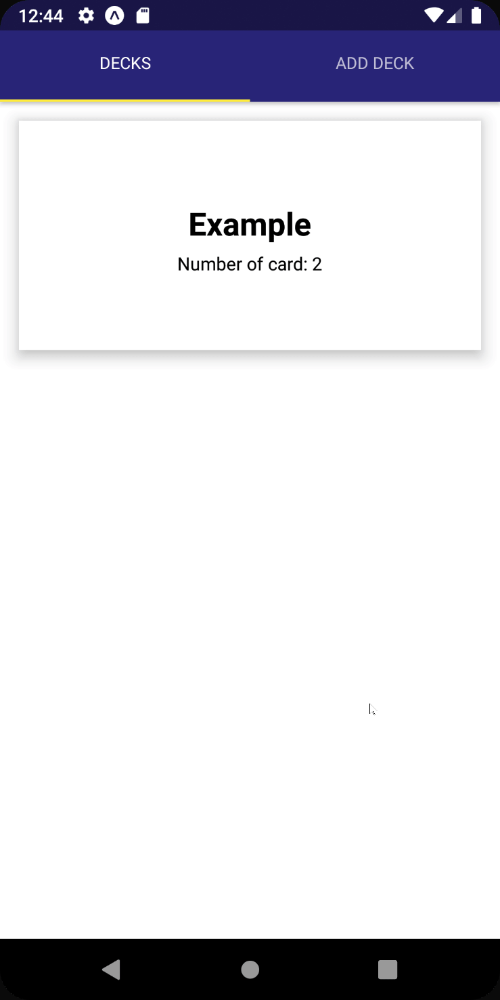

# FlashCard-ReactNative

This project is a mobile application (Android) that allows users to study collections of flashcards. The app will allow users to create different categories of flashcards called "decks", add flashcards to those decks, then take quizzes on those decks. See demo below.

## Install
  ```bash
  $> git clone https://github.com/phuocthevo/FlashCard-ReactNative.git
  ```
  ```bash
  $> yarn install
  ```
  ```bash
  $> yarn start
  ```
## Demo



## License
[MIT](./LICENSE)
